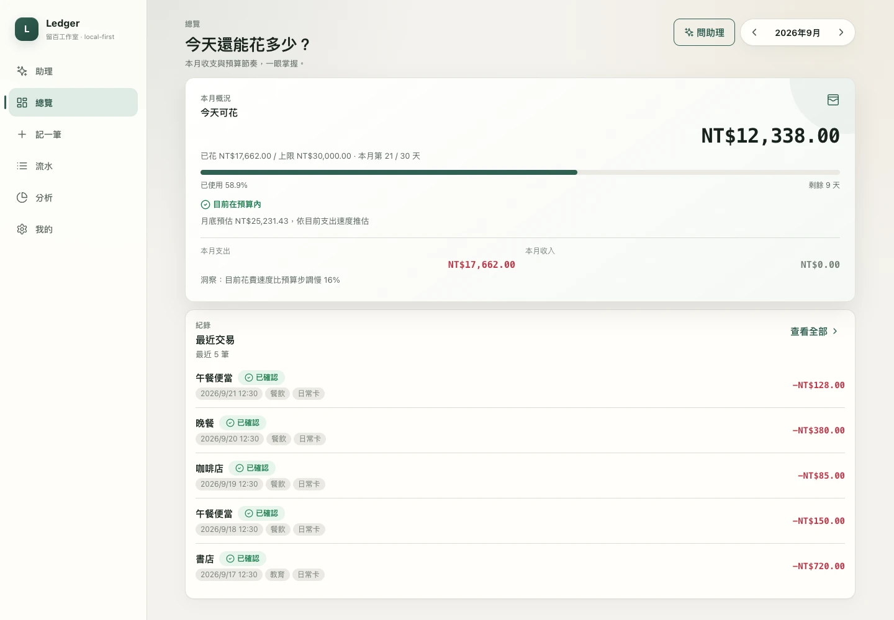
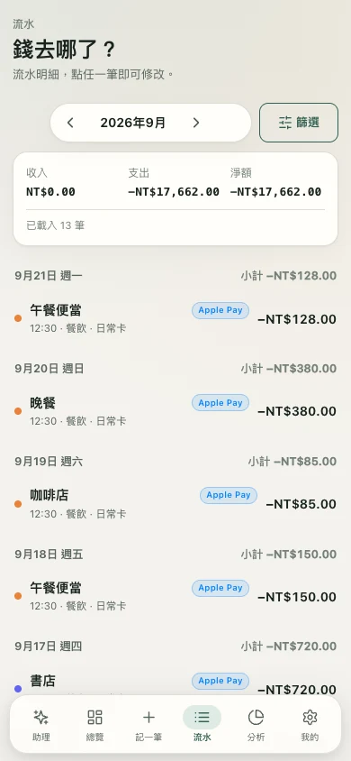
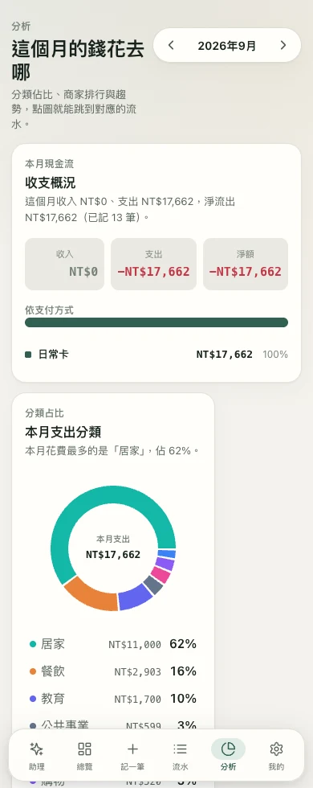

# Ledger · 留百工作室

Local-first 個人記帳系統：FastAPI + SQLite + React。用 iPhone 捷徑接收 Apple Pay 交易觸發資料，再送進自己部署的帳本。

**[產品網站與完整圖文教學](https://liubai-ledger.vercel.app/) · [互動示範](https://liubai-ledger.vercel.app/demo) · [安裝捷徑](https://liubai-ledger.vercel.app/#guide)**

覺得有幫助，歡迎在本專案右上角按 **Star**。MIT 開源；示範網站不接收私人交易，不需要銀行登入。

## 實際介面

下圖由真正的前端與獨立示範資料庫產生。所有帳目都是虛構，不是作者的私人帳目。



| 手機流水 | 手機分析 |
| --- | --- |
|  |  |

## 自己部署

需要 Python 環境（建議 3.11+）、Node.js >=22.12 與 Git。從本頁 **Code → HTTPS** 複製專案 clone URL，clone 後在專案根目錄執行：

```sh
python3 -m venv backend/.venv
source backend/.venv/bin/activate
pip install -r backend/requirements.txt
python3 scripts/setup_env.py
(cd frontend && npm ci && npm run build)
cd backend
python -m uvicorn app.web:app --env-file ../.env --host 127.0.0.1 --port 8000
```

打開 `http://127.0.0.1:8000`。這個入口在同一個 port 提供網站與 API，**不要設定 VITE_PUBLIC_DOCS=1**；那是只供官網的模式。

`setup_env.py` 產生新的隨機 Ingest Token，建立權限 0600 的根目錄 `.env`，不讀取或覆蓋既有設定。只建立檔案不會自動載入：請使用上述 `--env-file` 參數。

讓 iPhone 也能使用：在主機和手機設定自己的 Tailscale，主機執行：

```sh
tailscale serve --bg http://127.0.0.1:8000
```

複製命令顯示的 HTTPS URL；iPhone 連接自己的 tailnet，再用 Safari 開啟 `該網址/api/health`。HTTP 200 與 `status: ok` 只代表可連線，後續仍須驗證 Token 與寫入。

## 捷徑安裝與 Apple Pay

1. 從官網下載 [手動記帳](https://liubai-ledger.vercel.app/shortcuts/Ledger-Manual.shortcut) 與 [Apple Pay 接收範本](https://liubai-ledger.vercel.app/shortcuts/Ledger-ApplePay.shortcut)。用 iPhone Safari／檔案 App 開啟 `.shortcut`，檢查動作後加入捷徑。
2. 在兩個範本的最前面填入自己的 `/api/wallet` URL，以及自己主機 `.env` 內的 `LEDGER_INGEST_TOKEN` 值。不要把 Token 貼到官網或 GitHub。
3. 先用手動版記錄一筆 1 元示範，核對回應 `ok: true`、`tx_id` 與 Ledger 流水。
4. 在 iPhone 捷徑中新增「交易」自動化，選自己的卡片，設定立即執行或關閉執行前詢問。依 iOS 版本，入口也可能在「編輯 → 自動化」。
5. 自動化先建立字典：`amount`=交易金額、`merchant`=交易商家、`card`=卡片或票卡、`occurred_at`=ISO 8601 日期。值必須綁定魔術變數，不能只輸入文字「金額」。
6. 「執行捷徑 → Ledger Apple Pay」，**輸入選剛才的字典**。再做一次自己的 Apple Pay 實機測試，核對流水。交易沒提供時間時，在觸發流程中取目前日期，格式化成 ISO 8601。

[範本原始碼、簽署與驗證界線](shortcuts/README.md)。簽署完成不等於已在每台 iPhone 驗收；卡片、iOS 版本及付款情境會影響觸發和欄位。不是銀行直連、歷史帳單同步或全 Apple Pay 交易抓取。

## 安全與資料界線

**這是單使用者私人部署，不是多租戶 SaaS。X-Ledger-Token 只保護 `/api/wallet`，其他帳目 API 尚未具備完整登入保護。請使用私人 tailnet，或先完成整站身分驗證閘道；不可將所有 API 裸露到公網。**

作者的資料庫、帳號、私人 host、API key、Git 歷史與 log 不包含在此專案。初始資料只有通用分類和現金／未指定卡片。位置預設不存、原始 Wallet payload 不寫 log；可選 AI 與地圖服務可能涉及第三方，須由部署者明確設定並理解資料流。

請勿分享填好 Token 的捷徑或 `.env`。Token 放在 HTTP header，不要放在 URL。任何 debug log、資料庫、備份與截圖都應作為私人資料管理。

## 測試

```sh
(cd backend && python -m pytest -q)
(cd frontend && npm run lint && npm run build && npm audit)
```

## 官方參考

- [Apple：交易觸發器](https://support.apple.com/zh-tw/guide/shortcuts/apd65c67538a/ios)
- [Apple：分享捷徑／檔案匯入](https://support.apple.com/zh-tw/guide/shortcuts/apdf01f8c054/ios)
- [Apple：加入匯入問題](https://support.apple.com/guide/shortcuts-mac/add-import-questions-to-shared-shortcuts-apdf330fd3a0/mac)
- [Tailscale Serve](https://tailscale.com/kb/1312/serve)

教學查核日期：2026-09-21。依個別系統版本確認畫面與權限。

MIT — © 2026 留百工作室
