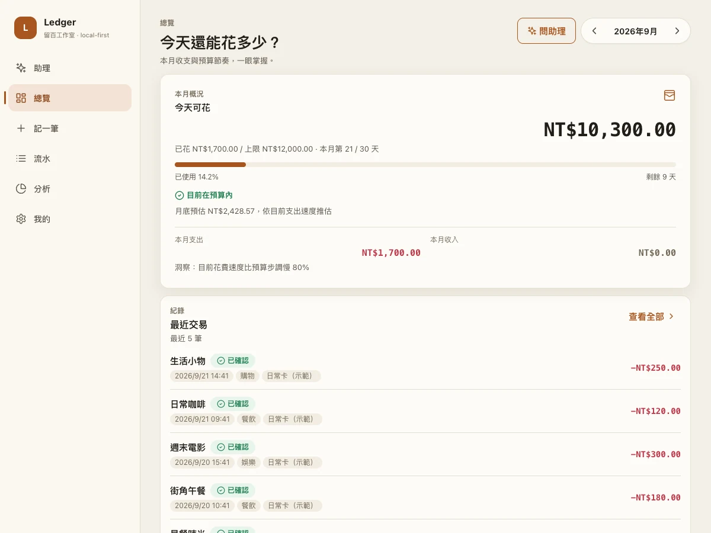

# Ledger · 留白工作室

[Threads · @blankspacestw](https://www.threads.net/@blankspacestw)

自己的資料，自己的日常。開源、可自架的個人記帳系統，使用 FastAPI + SQLite + React。

[產品網站](https://liubai-ledger.vercel.app) · [互動帳本示範](https://liubai-ledger.vercel.app/demo) · [畫面導覽](https://liubai-ledger.vercel.app/#preview) · [捷徑安裝](https://liubai-ledger.vercel.app/#shortcuts) · [iPhone 自動化教學](https://liubai-ledger.vercel.app/#automation)

喜歡這個小工具，歡迎在本頁右上角按 **Star**。公開網站是展示與教學，不會接收你的交易，也不連到作者的私人帳本。

## 畫面



[流水畫面](frontend/public/screens/transactions.webp) · [手動記帳畫面](frontend/public/screens/capture.webp)

截圖均來自獨立建立的虛構資料庫，不是任何人的真實交易。產品網站的「模擬刷卡」只改變瀏覽器記憶體中的展示資料。

## 功能與邊界

- 手動記帳、交易編輯、帳戶、分類、月預算與分析。
- Wallet 交易自動化 → 自己的捷徑 → POST /api/wallet。
- 初始帳戶只有現金與未指定卡片；使用者自行新增卡片與別名。
- 基本記帳不依賴 AI；位置預設不保存，AI 供應者需另行配置。
- 這不是銀行同步服務。iPhone Wallet 的感應觸發器不保證涵蓋 Apple Watch、App 內付款、網購或退款，需逐項實測。
- 本版為單使用者、自架系統。**X-Ledger-Token 只驗證 /api/wallet，不保護其他帳戶、流水、匯出 API。**請使用私人網路，或自行在整個服務前建立登入／存取閘道。不要把裸 API 直接對外公開。

## 安裝自己的 Ledger

準備 Git、Python 3.11+、Node.js 22.12+。Mac / Linux 可使用以下流程；Windows 需依環境調整虛擬環境啟動命令。

先從本頁的 Code 選單複製 repository URL，clone 到名為 ledger 的資料夾，進入該目錄。以下命令從 **專案根目錄** 開始：

```bash
python3 -m venv .venv
source .venv/bin/activate
pip install -r backend/requirements.txt
cp .env.example .env
python3 -c 'import secrets; print(secrets.token_urlsafe(32))'
```

也可使用 `python3 scripts/setup_env.py` 自動建立權限 0600 的 .env 與新 Token，該工具不覆蓋既有設定。

採用上方手動方式時，把最後一行產生的長隨機值寫進自己的 `.env` 的 `LEDGER_INGEST_TOKEN`。不要使用預設值，也不要把這個值放到公開網站或 commit。

建立自架前端（不要設定 `VITE_PUBLIC_DOCS=1`，那是本專案公開教學站才使用的建置選項）：

```bash
cd frontend
npm ci
npm run build
cd ..
```

同一個服務提供網站與 API，而且確實載入剛設定的 `.env`：

```bash
.venv/bin/python -m uvicorn app.web:app --app-dir backend --env-file .env --host 127.0.0.1 --port 8000
```

電腦打開 `http://localhost:8000`。健康檢查是 `http://localhost:8000/api/health`，應回 `status: ok`。服務必須保持運作，手機才能連線。

手機使用私人 HTTPS 網址：建議 iPhone 與主機登入同一個 Tailscale 網路，以 **Tailscale Serve 指向本機 8000**。完整操作與可複製命令放在[網站部署步驟](https://liubai-ledger.vercel.app/#install)；另見 [Tailscale 官方 Serve 文件](https://tailscale.com/kb/1242/tailscale-serve)。不要用 Funnel 公開私人帳本。

## 安裝 iPhone 捷徑

先看[哪裡要改、哪些不能刪](https://liubai-ledger.vercel.app/#shortcut-fields)。註解可保留；兩個「文字」是執行必要的 URL 與 Token，請只改內容、不要刪除動作。下面的辭典取值、URL、POST 動作也要保留。


在 iPhone Safari 下載以下已簽章的公開模板：

- [Ledger Wallet](https://liubai-ledger.vercel.app/shortcuts/Ledger-Wallet.shortcut)：接收交易自動化的字典輸入。
- [Ledger Manual](https://liubai-ledger.vercel.app/shortcuts/Ledger-Manual-v1_1.shortcut)：手動詢問金額、商家與卡片／現金。

從 Safari 下載項目或「檔案」App 打開檔案，加入捷徑。打開捷徑右上角 ⋯，將最上方兩個文字動作依序改為：

1. 自己的完整 HTTPS endpoint：`https://自己的主機/api/wallet`。
2. 自己的 `LEDGER_INGEST_TOKEN`。

請先使用 Manual 以商家「連線測試」、金額 1 元測通，再到自己的流水確認。測試交易需要時自行刪除。

Wallet 版安裝完成不代表自動化已設定：在 iPhone 的捷徑 App 建立「交易／錢包」自動化，新增字典，把交易輸出的 Amount、Merchant、Card or Pass 分別綁到 `amount`、`merchant`、`card`，再執行 Ledger Wallet，輸入選前一步字典。

[完整安裝文件](docs/APPLE_PAY_SHORTCUTS.md) · [四步驟操作圖解](https://liubai-ledger.vercel.app/#automation) · [模板來源及簽章說明](shortcuts/README.md)

下載模板使用不可連線的 `example.invalid` 占位網址，沒有作者的私有主機、憑證或卡片。模板不要求定位，時間由伺服器補上（`server_received`），不假稱是銀行提供的原始時間。

**驗證範圍：**可檢查 plist 結構、動作引用、macOS anyone 簽章與公開下載內容；不代表已在每部 iPhone 完成匯入和真實感應交易驗收。簽章也不是 Apple 對本專案的審核或推薦。

## 本機開發

API-only 模式仍可使用 `app.main:app`。Vite 開發伺服器預設 5173，透過 /api 代理到 8000；請勿將開發伺服器未經保護地對外公開。

```bash
cd backend
../.venv/bin/python -m pytest -q
cd ../frontend
npm run lint
npm run build
npm audit
```

`app.web` 的測試需要前端 dist 存在，因此完整檢查請先執行一次前端 build。`scripts/check_public_site.py` 為公開網站測試，需額外的 Playwright/Pillow 與 Chrome；這些不是執行 Ledger 的必要依賴。

## 資料與隱私

不要提交 `.env`、SQLite、log、交易匯出、真實收據或含卡號的截圖。公開程式使用 generic 本機 user id，不內建作者帳戶資訊。公用捷徑來源是重新建立的，不沿用含私人設定的分享連結。

匯出檔案與備份請保存在自己的安全儲存空間。啟用雲端 AI 會把相關辨識內容送到你配置的供應者；啟用消費地圖也會向圖磚供應者請求資源。

## License

MIT — © 2026 留白工作室。第三方套件與圖示依各自授權。
